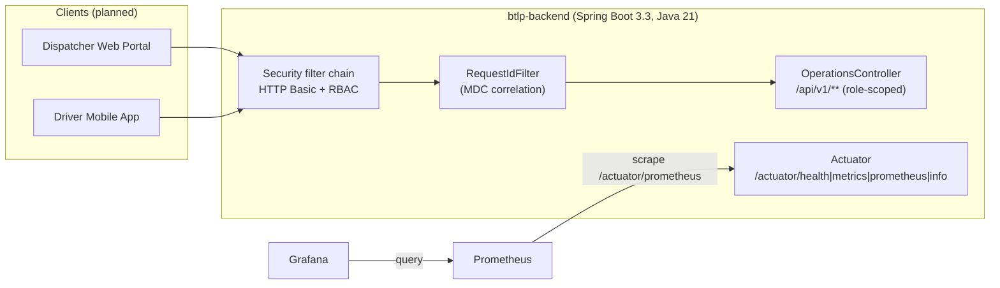
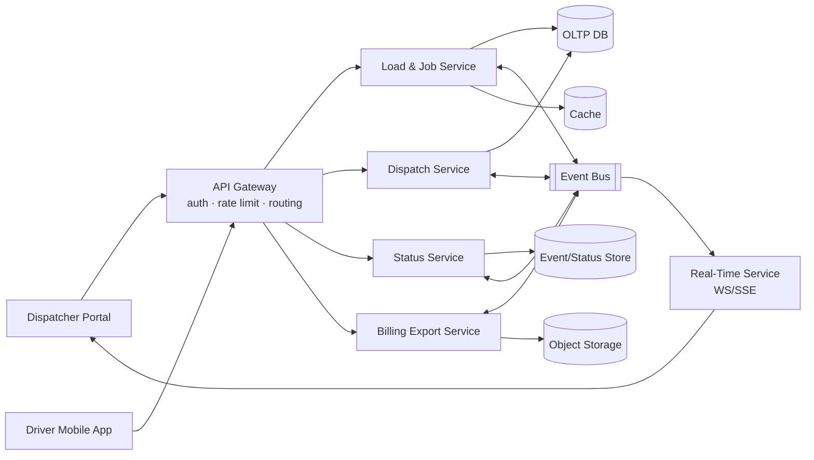
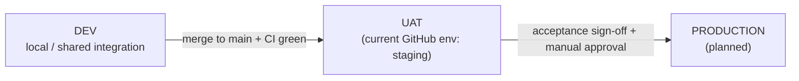
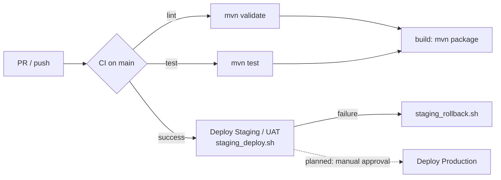

# BTLP Platform — Architecture & Environments

> **Status: DRAFT for review.** This document describes both the **current state** (what exists in the repository today) and the **target state** (what the design document and roadmap call for). Sections are explicitly labeled so readers can distinguish what is implemented from what is planned. Items requiring decisions are collected in [Assumptions & Open Questions](#10-assumptions--open-questions).

## 1. Purpose & Scope
This document defines:
- The **application architecture** of the BTLP (trucking logistics) platform — current and target.
- The **dev, UAT, and production environments** and how code is promoted between them.
- The **CI/CD** pipeline, branching model, and release/rollback process.

Sources: `trucking-logistics-platform-design.md` (design), `trucking-logistics-mvp-roadmap.md` (22-week plan), and the existing repository code (`backend/`, `.github/`, `scripts/`, `backend/monitoring/`).

## 2. Current State vs. Target State (at a glance)
| Aspect | Current state (implemented) | Target state (design/roadmap) |
| --- | --- | --- |
| Application shape | Single Spring Boot service (`btlp-backend`), modular monolith with stub endpoints | Service-oriented system (Load/Job, Dispatch, Status, Real-Time, Billing Export) behind an API gateway, integrated via an event bus |
| Auth | Spring Security HTTP Basic + in-memory users (scaffold, dev-only creds) | OAuth/JWT via real identity provider, RBAC, multi-tenant scoping |
| Datastores | PostgreSQL (OLTP) with Liquibase migrations for the core entities (issue #8); event store, cache, object storage not yet provisioned | OLTP DB, event/status store, cache, object storage |
| Environments | Local dev + `staging` GitHub environment (auto-deploy) | dev → UAT → production with gated promotion |
| CI/CD | GitHub Actions CI (lint/test/build) + auto-deploy to `staging` | + gated production promotion, containerized artifacts, smoke tests |
| Observability | Actuator + Prometheus + Grafana + alert rules (local compose; baseline active) | Managed metrics/logs/traces, alert routing to on-call |

The platform is at the **end of Phase 1 (Foundation)** of the roadmap. The architecture below is intentionally forward-looking but anchored to what exists today.

## 3. Application Architecture

### 3.1 Current state — modular monolith
The backend is a single deployable Spring Boot application.

- **Runtime / stack:** Java 21, Spring Boot 3.3.2, Maven. Module: `backend/` (`com.topnotchbroker.btlp`).
- **Web layer:** `spring-boot-starter-web` (embedded Tomcat, port `8080`). `OperationsController` exposes representative role-scoped endpoints (`/api/v1/me`, `/api/v1/dispatch/jobs`, `/api/v1/driver/assignments`, `/api/v1/billing/exports`, `/api/v1/admin/users`).
- **Security:** `spring-boot-starter-security` with HTTP Basic and an in-memory user store (`SecurityConfig`). Roles: `DISPATCHER`, `DRIVER`, `BILLING`, `ADMIN`. `/actuator/**` is permitted unauthenticated; all `/api/v1/**` require authentication and the appropriate role. Consistent JSON error contracts for 401/403 (`ApiAuthenticationEntryPoint`, `ApiAccessDeniedHandler`, `ApiErrorResponse`).
- **Observability:** `spring-boot-starter-actuator` + `micrometer-registry-prometheus`. Endpoints exposed: `health, metrics, prometheus, info`. Per-request correlation via `RequestIdFilter` (MDC `requestId` in the log pattern).

> **Note:** Clients (portal, mobile app) and persistent datastores are not yet implemented; the endpoints are scaffolding that establishes the security, error-handling, and observability baseline.

### 3.2 Target state — service-oriented (per design document)
The design document specifies a decomposed, event-driven architecture:

- **Web App (Dispatcher Portal)** — load/job creation, dispatch board, live tracking, export UI.
- **Driver Mobile App** — job inbox, status updates, offline sync.
- **API Gateway** — authentication, rate limiting, routing.
- **Load & Job Service** — core domain (loads, jobs, assignments).
- **Dispatch Service** — assignment lifecycle and notifications.
- **Status Service** — ingest status events, enforce state transitions.
- **Real-Time Service** — WebSocket/SSE fanout to portal clients.
- **Billing Export Service** — CSV/JSON exports to downstream systems.
- **Event Bus** — decouples status/dispatch/billing events.
- **Datastores** — OLTP DB, event/status history store, cache, object storage for exports.

**Migration path:** the current monolith is expected to evolve toward this design by extracting services along the module boundaries (loads/jobs → dispatch → status → real-time → billing), introducing the event bus and datastores in Phase 2+ of the roadmap. Decomposition should be driven by the roadmap milestones rather than done up front.

### 3.3 Key non-functional requirements (target)
From the design document: 99.9% availability for core APIs; status latency < 2s p95 (driver submit → dispatcher UI); horizontal scaling for API and real-time services; durable event history; strong consistency for assignment acceptance, eventual consistency acceptable for dashboards.

## 4. Environments
The platform uses a three-stage promotion model. **Code only moves forward by passing automated gates and (for production) explicit approval.**

### 4.1 Dev
- **Purpose:** day-to-day feature development and fast iteration.
- **Current state:** **local** developer machines. Run the backend with `cd backend && mvn spring-boot:run` (port `8080`). The local monitoring stack runs via `backend/monitoring/docker-compose.monitoring.yml` (Prometheus `:9090`, Grafana `:3000`).
- **Auth/data:** in-memory scaffold users (`dispatcher/driver/billing/admin` + `*-pass`); local **PostgreSQL** via `backend/docker-compose.db.yml` (Liquibase applies the schema on startup).
- **Config/secrets:** local only; no cloud secrets required.
- **Planned:** an optional **shared dev integration environment** (the roadmap references "dev and staging environments"). Not yet automated in CI/CD.

### 4.2 UAT (User Acceptance Testing / pre-production)
- **Purpose:** stakeholder demos, user acceptance testing, and **weekly releases** (per roadmap). Validates a release candidate in a production-like setting before promotion.
- **Current state:** implemented today as the GitHub **`staging`** environment. `deploy-staging.yml` auto-deploys every commit to `main` after CI succeeds (continuous delivery to UAT). The epic #1 acceptance criterion "logging and error monitoring baseline active in staging" maps to this environment.
- **Deploy mechanism:** `scripts/deploy/staging_deploy.sh` runs the command stored in the `STAGING_DEPLOY_COMMAND` secret (the concrete target is intentionally abstracted behind the secret).
- **Auth/data:** should use a real identity provider and an isolated, non-production datastore (target). Currently inherits the scaffold auth until the IdP lands.
- **Naming note:** the repo environment is literally named `staging`; this document treats it as **UAT**. Recommendation: either rename the GitHub environment to `uat` or formally adopt "staging = UAT" to avoid ambiguity (see open questions).

### 4.3 Production
- **Purpose:** live pilot and customer-facing service (roadmap Phase 8).
- **Current state:** **not yet implemented** — there is no production workflow, environment, or secrets.
- **Planned characteristics:**
  - Promotion **gated by manual approval** (GitHub environment protection rules / required reviewers) after UAT sign-off.
  - Deploy from an immutable, versioned artifact (tagged release / image digest) — the same artifact validated in UAT.
  - Progressive rollout (blue/green or rolling) with automated **smoke tests / health checks** post-deploy.
  - Hardened security: OAuth/JWT IdP (no scaffold creds), `/actuator/**` restricted to an internal management port/network, secrets via a managed secret store, TLS in transit, PII encryption at rest.
  - Full observability with alert routing to on-call; backups and a documented DR/runbook.
  - Targets the design NFRs (99.9% availability, < 2s p95 status latency).

### 4.4 Environment matrix
| | Dev | UAT (`staging` today) | Production (planned) |
| --- | --- | --- | --- |
| Trigger | manual (developer) | auto after CI on `main` | manual approval (promote UAT artifact) |
| Identity | in-memory scaffold | real IdP (target) | real IdP, MFA for admin |
| Data | local PostgreSQL (docker-compose) | isolated non-prod PostgreSQL | production datastore + backups |
| Secrets | none | `STAGING_DEPLOY_COMMAND` (GH secret) | managed secret store |
| Actuator exposure | open (local) | restricted (recommended) | internal-only |
| Observability | local Prometheus/Grafana | persistent stack + dashboards | persistent + alert routing/on-call |
| Rollback | restart | `staging_rollback.sh` | versioned redeploy + smoke test |

## 5. CI/CD

### 5.1 Branching & PR model (`CONTRIBUTING.md`)
- Trunk-based: branch from `main`, short-lived branches named `feature/…`, `fix/…`, `chore/…`, `docs/…` (lowercase, hyphenated).
- A PR is required for every change; **no direct pushes to `main`**. One concern per PR; link the issue (`Closes #N`).
- **Required, branch-protected checks:** `lint`, `test`, `build`. One approving review; all review comments resolved; **squash merge** for linear history.
- Ready-to-merge: branch up to date with `main`, checks pass, approvals present, rollout/rollback notes in the PR.

### 5.2 CI pipeline (`.github/workflows/ci.yml`)
- **Triggers:** all pull requests and pushes to `main`.
- **Jobs:** `lint` and `test` run in parallel; `build` runs only after both pass (`needs: [lint, test]`).
- **Toolchain per job:** Node 20, Python 3.12, Java 21 (Temurin, Maven cache).
- **Surface-aware scripts** (`scripts/ci/*.sh`) detect `backend/` (Maven) and `frontend/` (npm) surfaces:
  - `lint.sh` → backend `mvn -B validate` (or `npm run lint` for a Node surface)
  - `test.sh` → backend `mvn -B test`
  - `build.sh` → backend `mvn -B package -DskipTests`
  - If a surface exists but exposes no supported command, CI fails; if no surfaces exist, the step is intentionally skipped.
- **Artifact (current):** the Spring Boot fat jar `backend/target/btlp-backend-0.0.1-SNAPSHOT.jar`.

### 5.3 CD to UAT (`.github/workflows/deploy-staging.yml`)
- **Trigger:** `workflow_run` — after the **CI** workflow completes on `main` with `conclusion == success`.
- **Environment:** GitHub `staging` (= UAT in this document).
- **Steps:** checkout the exact `head_sha` from the successful CI run → run `scripts/deploy/staging_deploy.sh` (uses `STAGING_DEPLOY_COMMAND`) → on failure run `scripts/deploy/staging_rollback.sh` (uses optional `STAGING_ROLLBACK_COMMAND`) → write a deployment summary.

### 5.4 Promotion to production (planned)
There is **no production workflow yet.** Recommended design:
- A separate `deploy-production.yml` targeting a protected `production` GitHub environment with **required reviewers** (manual approval gate).
- Promote the **same artifact** already validated in UAT (promote-by-digest/tag, do not rebuild).
- Run post-deploy smoke tests and health checks; auto-trigger rollback on failure.

### 5.5 Rollback
- **UAT:** automatic on deploy failure via `staging_rollback.sh`. If `STAGING_ROLLBACK_COMMAND` is set it runs automatically; otherwise the workflow prints the manual path (identify last-known-good artifact → redeploy → re-run health/smoke checks).
- **Production (planned):** redeploy the previous known-good version/digest, then verify with smoke tests; keep the rollback runbook in the PR per the ready-to-merge rules.

## 6. Configuration & Secrets Management
- **Current:** single `backend/src/main/resources/application.yml` (no per-environment profiles yet). CI/CD secrets stored as GitHub Actions secrets (`STAGING_DEPLOY_COMMAND`, optional `STAGING_ROLLBACK_COMMAND`) scoped to the `staging` environment.
- **Recommended:**
  - Introduce Spring profiles (`application-dev.yml`, `application-uat.yml`, `application-prod.yml`) and select via `SPRING_PROFILES_ACTIVE`.
  - Externalize all environment-specific values (DB URLs, IdP issuer/keys, endpoints) as environment variables; never commit secrets.
  - Use a managed secret store for UAT/production; keep GitHub environment-scoped secrets for deployment credentials only.

## 7. Observability (per environment)
- **Baseline (implemented):** Actuator + Micrometer Prometheus registry; Grafana dashboard "BTLP Backend — Service Health" (Service Up, request rate, 4xx/5xx error rate, error-rate-by-status, p95 latency); Prometheus alert rules in `backend/monitoring/alert_rules.yml` (`HighErrorRate` 5xx > 5% for 2m, `HighClientErrorRate` 4xx > 20% for 5m, `ServiceDown`). Structured logs carry a per-request `requestId`.
- **Dev:** the above runs locally via docker-compose.
- **UAT/Production:** run a persistent metrics/logging stack; wire `alert_rules.yml` to an Alertmanager (or managed equivalent) with notification routing. **Gap:** alert *routing*/on-call paging is not yet configured. Target adds distributed tracing and correlation IDs across services (per design doc §13).

## 8. Security Considerations
- Replace the in-memory HTTP Basic scaffold with the real **OAuth/JWT** identity provider and RBAC before any production exposure (README explicitly flags the scaffold creds as dev-only).
- Restrict `/actuator/**` outside dev (internal management port/network, or authenticated) — it is currently `permitAll` to enable local scraping.
- Enforce TLS in transit and PII encryption at rest; maintain audit logs for dispatch and billing actions; add multi-tenant scoping (design doc §11).

## 9. References
- Design: `trucking-logistics-platform-design.md`
- Roadmap: `trucking-logistics-mvp-roadmap.md`, `trucking-logistics-mvp-roadmap-stakeholder.md`
- CI/CD: `.github/workflows/ci.yml`, `.github/workflows/deploy-staging.yml`, `scripts/ci/*.sh`, `scripts/deploy/*.sh`
- Backend: `backend/pom.xml`, `backend/src/main/resources/application.yml`, `backend/src/main/java/com/topnotchbroker/btlp/**`
- Monitoring: `backend/monitoring/**`
- Conventions: `CONTRIBUTING.md`, `README.md`

## 10. Assumptions & Open Questions
These shape the environment/CI/CD design and need confirmation:
1. **Hosting/cloud target** — the deploy target is abstracted behind `STAGING_DEPLOY_COMMAND`. Which platform (AWS/GCP/Azure/managed PaaS) and region(s)?
2. **Containerization** — the app is not yet containerized (only the monitoring stack uses Docker). Standardize on a container image as the deployable artifact?
3. **UAT vs. staging naming** — rename the `staging` GitHub environment to `uat`, or keep `staging` as the UAT stage by convention?
4. **Datastores** — OLTP database is **decided: PostgreSQL**, with schema/migrations managed by Liquibase (issue #8). Event store, cache, and object storage remain open.
5. **Identity provider** — which OAuth/JWT IdP replaces the scaffold, and when?
6. **Production topology** — single vs. multi-region, availability/DR targets, and deployment strategy (blue/green vs. rolling)?
7. **Shared dev environment** — is a shared/integration dev environment needed, or is dev strictly local?
