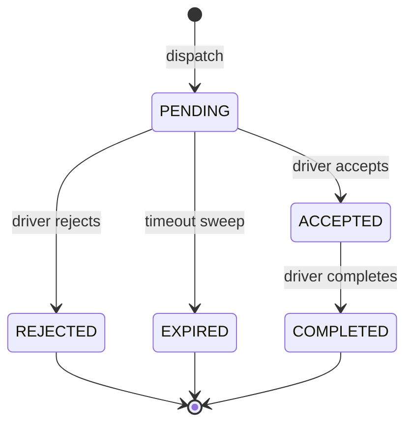

# Dispatch & Assignment Lifecycle API
Backend API contract for the dispatch and assignment lifecycle (epic #13): dispatchers assign jobs to drivers, drivers accept/reject/complete, and unanswered assignments expire on a timeout. This document is the reference for web/mobile clients and the M1 readiness demo.
All endpoints are under `/api/v1`, require HTTP Basic auth, and return the shared error envelope `{ "error": "<CODE>", "message": "<detail>" }` on failure.
## Lifecycle states
An assignment moves through these states:

Each outcome cascades to the job status and the driver's availability:
- **dispatch** → assignment `PENDING`; job stays `UNASSIGNED` (still actionable); driver unchanged.
- **accept** → assignment `ACCEPTED`; job `ASSIGNED`; driver `ON_TRIP`.
- **reject** → assignment `REJECTED`; job stays `UNASSIGNED`; driver unchanged.
- **expire** → assignment `EXPIRED`; job stays `UNASSIGNED`; driver unchanged.
- **complete** → assignment `COMPLETED`; job `COMPLETED`; driver `AVAILABLE`.
A job is considered to have an *active* assignment while one is `PENDING` or `ACCEPTED`; `REJECTED`/`EXPIRED`/`COMPLETED` free the job for re-dispatch.
## Roles
- Dispatch endpoints (`/api/v1/dispatch/**`) require `DISPATCHER` or `ADMIN`.
- Driver endpoints (`/api/v1/driver/**`) require `DRIVER` or `ADMIN`.
Development scaffold credentials: `dispatcher/dispatcher-pass`, `driver/driver-pass`, `admin/admin-pass`.
## Assignment representation
```json
{
  "id": "5b1c2f2e-6c1a-4e0b-9d0e-2a9f9d4c1a11",
  "jobId": "0f2a7b9c-1d3e-4a5b-8c7d-6e5f4a3b2c1d",
  "driverId": "9a8b7c6d-5e4f-3a2b-1c0d-0e1f2a3b4c5d",
  "state": "PENDING",
  "assignedAt": "2026-07-15T18:00:00Z",
  "acceptedAt": null,
  "expiresAt": "2026-07-15T18:15:00Z",
  "createdAt": "2026-07-15T18:00:00Z",
  "updatedAt": "2026-07-15T18:00:00Z"
}
```
## Endpoints
### Create a dispatch (dispatcher)
`POST /api/v1/dispatch/assignments`
Request:
```json
{ "jobId": "0f2a7b9c-1d3e-4a5b-8c7d-6e5f4a3b2c1d", "driverId": "9a8b7c6d-5e4f-3a2b-1c0d-0e1f2a3b4c5d" }
```
Responses:
- `201 Created` with a `Location: /api/v1/dispatch/assignments/{id}` header and the assignment body (`state: PENDING`, `expiresAt` set from the configured timeout).
- `404 NOT_FOUND` — unknown `jobId` or `driverId`.
- `409 CONFLICT` — the job already has a `PENDING`/`ACCEPTED` assignment.
- `400 VALIDATION_ERROR` — missing/invalid `jobId` or `driverId`.
### Get a dispatch (dispatcher)
`GET /api/v1/dispatch/assignments/{id}` → `200 OK` with the assignment, or `404 NOT_FOUND`.
### Accept an assignment (driver)
`POST /api/v1/driver/assignments/{id}/accept`
- `200 OK` with the assignment (`state: ACCEPTED`, `acceptedAt` set). Job → `ASSIGNED`, driver → `ON_TRIP`.
- `404 NOT_FOUND` — unknown assignment.
- `409 INVALID_STATE_TRANSITION` — the assignment is not `PENDING`, or its acceptance window has already elapsed.
### Reject an assignment (driver)
`POST /api/v1/driver/assignments/{id}/reject`
- `200 OK` with the assignment (`state: REJECTED`). Job remains actionable.
- `404 NOT_FOUND`, or `409 INVALID_STATE_TRANSITION` when not `PENDING`.
### Complete an assignment (driver)
`POST /api/v1/driver/assignments/{id}/complete`
- `200 OK` with the assignment (`state: COMPLETED`). Job → `COMPLETED`, driver → `AVAILABLE`.
- `404 NOT_FOUND`, or `409 INVALID_STATE_TRANSITION` when not `ACCEPTED`.
### Get an assignment (driver)
`GET /api/v1/driver/assignments/{id}` → `200 OK` or `404 NOT_FOUND`.
## Error catalog
- `400 VALIDATION_ERROR` — malformed body or missing required fields.
- `401 UNAUTHORIZED` — missing/invalid credentials.
- `403 FORBIDDEN` — authenticated but wrong role for the endpoint scope.
- `404 NOT_FOUND` — unknown job, driver, or assignment.
- `409 CONFLICT` — resource conflict (duplicate active assignment on dispatch; idempotency key reused for a different operation).
- `409 INVALID_STATE_TRANSITION` — the requested transition is illegal for the assignment's current state (deterministic, so clients can branch on it).
## Idempotency
The mutating endpoints (`POST` dispatch-create and driver `accept`/`reject`/`complete`) accept an optional `Idempotency-Key` request header.
- The first request for a given key executes and records its response.
- A retry with the **same key** replays the original response shape (same status and body) without re-executing — so a retried accept returns the original `200 ACCEPTED` rather than a `409`.
- Reusing a key for a **different** operation returns `409 CONFLICT`.
Clients should generate a unique key (e.g. a UUID) per logical action and reuse it only when retrying that same action.
## Timeout & expiration
A dispatched assignment is valid for a configurable window and is expired by a background sweeper:
- `btlp.dispatch.assignment-timeout` (default `PT15M`) — how long a `PENDING` assignment can be accepted.
- `btlp.dispatch.expiry-sweep-interval` (default `PT1M`) — how often the sweeper runs.
Accepting after the deadline returns `409 INVALID_STATE_TRANSITION`; the sweeper transitions the stale `PENDING` assignment to `EXPIRED`, returning the job to the actionable queue.
## M1 readiness demo
End-to-end walkthrough against a locally running backend (`cd backend && mvn spring-boot:run`, port `8080`). Uses scaffold credentials.
```bash
BASE=http://localhost:8080/api/v1

# 1) Create a load (dispatcher)
LOAD_ID=$(curl -s -u dispatcher:dispatcher-pass -H 'Content-Type: application/json' \
  -d '{"origin":"Chicago, IL","destination":"Columbus, OH"}' "$BASE/loads" | jq -r .id)

# 2) Create a job on that load
JOB_ID=$(curl -s -u dispatcher:dispatcher-pass -H 'Content-Type: application/json' \
  -d "{\"loadId\":\"$LOAD_ID\",\"jobType\":\"PICKUP\"}" "$BASE/jobs" | jq -r .id)

# 3) Create a driver
DRIVER_ID=$(curl -s -u dispatcher:dispatcher-pass -H 'Content-Type: application/json' \
  -d '{"name":"Alice Rivera","phone":"555-0100","licenseNumber":"LIC-001"}' "$BASE/drivers" | jq -r .id)

# 4) Dispatch the job to the driver (idempotent via Idempotency-Key)
ASSIGN_ID=$(curl -s -u dispatcher:dispatcher-pass -H 'Content-Type: application/json' \
  -H 'Idempotency-Key: demo-dispatch-1' \
  -d "{\"jobId\":\"$JOB_ID\",\"driverId\":\"$DRIVER_ID\"}" "$BASE/dispatch/assignments" | jq -r .id)

# 5) Driver accepts -> assignment ACCEPTED, job ASSIGNED, driver ON_TRIP
curl -s -u driver:driver-pass -X POST -H 'Idempotency-Key: demo-accept-1' \
  "$BASE/driver/assignments/$ASSIGN_ID/accept" | jq

# 6) Driver completes -> assignment COMPLETED, job COMPLETED, driver AVAILABLE
curl -s -u driver:driver-pass -X POST "$BASE/driver/assignments/$ASSIGN_ID/complete" | jq

# Reject variant (from a fresh PENDING assignment):
#   curl -s -u driver:driver-pass -X POST "$BASE/driver/assignments/$ASSIGN_ID/reject" | jq
```
